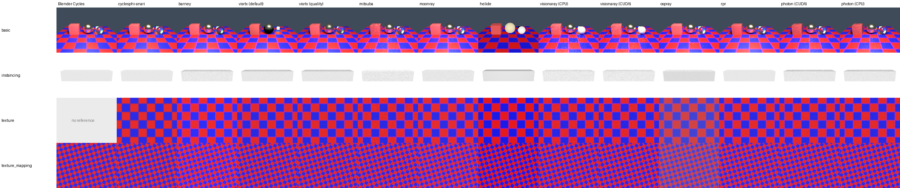
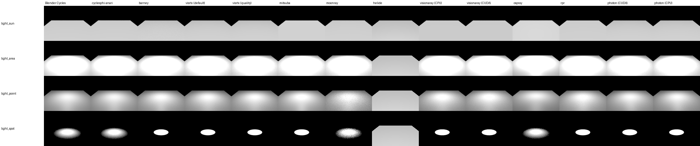
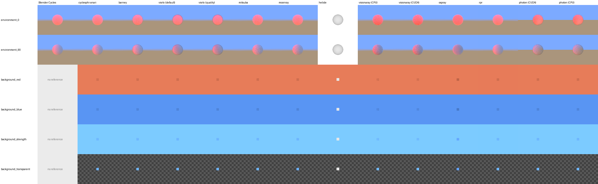
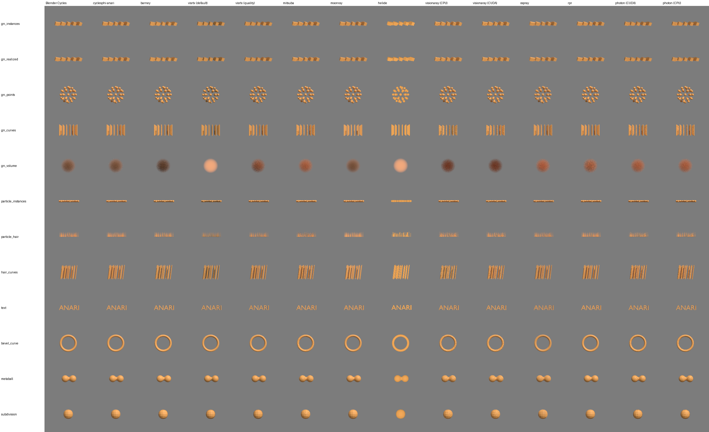

# ANARI rendering in Blender (blenderphi)

This branch of Blender (`main-anari`, Blender 5.3 alpha) can render through
[ANARI](https://www.khronos.org/anari/) devices. ANARI is implemented as a Cycles device
(`DEVICE_ANARI`): Blender syncs the scene into Cycles as usual, and the ANARI device mirrors
the Cycles scene (`ccl::Scene`) into ANARI objects and renders it with the selected ANARI
back-end. Any ANARI library can be used. The ones built and tested here are:

| ANARI library | Renderer | Hardware |
|---|---|---|
| `cycles` | [cyclesphi-anari](https://github.com/It4innovations/cyclesphi-anari): Cycles itself as an ANARI device | CPU, CUDA, OptiX |
| `barney` | [barney](https://github.com/ingowald/barney) | CUDA/OptiX |
| `visrtx` | [VisRTX](https://github.com/NVIDIA/VisRTX), RTX device | OptiX |
| `mitsuba` | [mitsuba-anari](https://github.com/jar091/mitsuba3-anari): Mitsuba 3 | CUDA (`cuda_ad_rgb`), CPU (`llvm_ad_rgb`, `scalar_rgb`) |
| `moonray` | [openmoonray-anari](https://code.it4i.cz/blender/openmoonray-anari): DreamWorks MoonRay | CPU (XPU) |
| `helide` | ANARI-SDK reference device | CPU |
| `visionaray`, `visionaray_cuda` | [anari-visionaray](https://github.com/jar091/anari-visionaray): Visionaray | CPU, CUDA (one library each) |
| `ospray` | [anari-ospray](https://github.com/jar091/anari-ospray): Intel OSPRay | CPU |
| `rpr` | [RadeonProRenderANARI](https://github.com/jar091/RadeonProRenderANARI): AMD Radeon ProRender (Northstar) | GPU (CUDA on NVIDIA, HIP on AMD), CPU fallback |
| `photon` | [Photon](https://github.com/jar091/photon): Kokkos path tracer | CUDA with OptiX, or CPU with Embree (two builds of the same library) |

Everything described here was built and tested on Windows 11 with Visual Studio 2022, in
one workspace directory (`F:\work\anari`). Nothing is installed outside of it.

Contents:

1. [How it works](#1-how-it-works)
2. [Workspace and sources](#2-workspace-and-sources)
3. [Prerequisites](#3-prerequisites)
4. [Building](#4-building)
5. [Using ANARI in Blender](#5-using-anari-in-blender)
6. [Smoke tests](#6-smoke-tests)
7. [Test results](#7-test-results)
8. [Known differences and limitations](#8-known-differences-and-limitations)
9. [Changes made to the ANARI devices](#9-changes-made-to-the-anari-devices)

## 1. How it works

* `intern/cycles/device/anari/` holds the ANARI Cycles device:
  * `device.cpp` loads ANARI libraries and lists their devices.
  * `device_impl.cpp` owns the ANARI device and frame.
  * `scene.cpp` (`AnariScene`) mirrors the Cycles scene: meshes, curves, point clouds,
    volumes, instances, lights, camera, world/background and integrator settings.
  * `material.cpp` (`AnariMaterialBuilder`) turns Cycles shader graphs into ANARI materials
    and samplers (`physicallyBased` or `matte`, with image textures, mapping, vertex colors
    and constants) and volume shaders into volume parameters.
* `intern/cycles/integrator/path_trace_work_anari.cpp` replaces the Cycles path tracing work
  for the ANARI device. It renders ANARI frames and copies the color, depth, normal, albedo
  and id channels into the Cycles render buffers. Cycles film conversion, passes and the
  denoiser then work as usual.
* `intern/cycles/blender/addon_anari/` is the `ANARI` render engine add-on. It provides
  preferences (library search paths), the device selection and the device parameters. The
  ANARI engine reuses the Cycles panels that apply.
* `tests/python/anari_smoke_tests.py` holds the smoke tests, see [section 6](#6-smoke-tests).

What is exported:

* **Geometry.** Triangle meshes with normals, UVs and vertex colors; subdivision surfaces
  (after Blender's subdivision); hair and curves as `curve` geometry; point clouds as
  `sphere` geometry. Geometry nodes instances become ANARI instances.
* **Volumes.** The density grid of `Volume` geometry (from geometry nodes or `.vdb` files) is
  read from the NanoVDB grid Cycles builds and resampled into a `structuredRegular` field.
  It is rendered as a `principled` volume on cyclesphi-anari (Cycles' own Principled Volume)
  and as a `transferFunction1D` volume on the other devices: constant albedo and an
  extinction proportional to the density.
* **Materials.**
  * The Principled BSDF and diffuse-only shaders become `physicallyBased` or `matte`
    materials.
  * Image textures, with their mapping node, become `image2D` samplers.
  * Emission becomes the material's emissive color.
* **Lights.** Point (with radius), spot (with blend), area (rectangle) and sun lights, with
  visibility to the camera.
* **World.**
  * An environment texture or constant world color becomes an `hdri` light, with its
    rotation from the mapping node.
  * The world color is also the renderer background.
  * Transparent film is supported.
* **Camera.** Perspective (with depth of field), orthographic and equirectangular panorama
  cameras, render borders, and clipping.
* **Integrator.** Bounces, clamping, filter width and light tree settings are passed to
  cyclesphi-anari as renderer parameters. The other devices use the generic
  `pixelSamples`/`maxRayDepth`.

## 2. Workspace and sources

All repositories are cloned side by side in `F:\work\anari`. Builds go to
`F:\work\anari\build\<name>` and installs to `F:\work\anari\install`.

| Directory | Repository | Branch |
|---|---|---|
| `ANARI-SDK` | https://github.com/jar091/ANARI-SDK | `mjar/devel`, based on `next_release` (ANARI 0.17) |
| `barney` | https://github.com/jar091/barney | `mjar/devel`, based on `main` (with submodules) |
| `VisRTX` | https://github.com/jar091/VisRTX | `mjar/devel`, based on `next_release` |
| `cyclesphi-anari` | https://github.com/It4innovations/cyclesphi-anari | `cyclesphi_dev`, merged with jeffamstutz/anari-cycles |
| `mitsuba-anari` | https://github.com/jar091/mitsuba3-anari | `main` (with submodules: Mitsuba 3 in `ext/mitsuba3`) |
| `openmoonray-anari` | https://code.it4i.cz/blender/openmoonray-anari | `main` |
| `visionaray` | https://github.com/jar091/visionaray | `mjar/devel`, same as `master` (header-only ray tracing library) |
| `anari-visionaray` | https://github.com/jar091/anari-visionaray | `mjar/devel`, based on `main` |
| `anari-ospray` | https://github.com/jar091/anari-ospray | `mjar/devel`, based on `main` |
| `RadeonProRenderANARI` | https://github.com/jar091/RadeonProRenderANARI | `mjar/devel`, based on `main`: ported to ANARI 0.17 and RadeonProRender SDK 3.1.7.1 |
| `photon` | https://github.com/jar091/photon | `mjar/devel`, based on `main`: with a new ANARI device |
| `blenderphi` | https://github.com/It4innovations/blenderphi | `main-anari` |
| `pynari` | https://github.com/jar091/pynari | `mjar/devel` (`jar091/devel` merged with the upstream `master`), see [`pynari/doc/windows/README.md`](../../../pynari/doc/windows/README.md) |

Install layout:

```
install/
  bin/              ANARI SDK, helide, barney, VisRTX, anari-visionaray (CPU and CUDA),
                    cyclesphi-anari (+ bin/cycles/lib kernels)
  include/visionaray, lib/cmake/visionaray
  lib/cmake/anari-0.17.0
  mitsuba/bin/      mitsuba-anari and Mitsuba / Dr.Jit DLLs
  moonray/          MoonRay runtime: bin/, rdl2dso/, coredata/, shaders/
  ospray/bin/       anari-ospray and the OSPRay runtime (Embree, Open VKL, OIDN, TBB)
  rpr/bin/          RadeonProRenderANARI, RadeonProRender64.dll, Northstar64.dll,
                    cudart64_13.dll, hipbin/ (GPU kernels), cache/ (written at runtime)
  photon/bin/       Photon, GPU build (Kokkos Cuda, OptiX)
  photon_cpu/bin/   Photon, CPU build (Kokkos Threads, Embree) with Blender's Embree and TBB
  kokkos-cuda/, kokkos-host/   the two Kokkos installs
external/
  llvm/             LLVM release with LLVM-C.dll (Mitsuba llvm_ad_rgb)
  ospray/           OSPRay 3.2.0 binary release
  rpr/              RadeonProRender SDK 3.1.7.1 with the hipbin kernels
  cuda13/           CUDA 13 runtime (cudart64_13.dll) for Northstar
  kokkos/           Kokkos 5.2.2 sources
build/
  blender/bin/Release/blender.exe
  logs/             build and test logs
  test_out/<library>/   images written by the smoke tests
```

## 3. Prerequisites

| Tool | Version used |
|---|---|
| Visual Studio 2022 (C++ workload) | 17.14 |
| CMake | 4.2.1 (barney needs `-DCMAKE_POLICY_VERSION_MINIMUM=3.5`) |
| CUDA Toolkit | 12.8 |
| OptiX headers | 9.0, from `barney/submodules/optix` (used by barney, VisRTX and cyclesphi-anari) |
| OptiX SDK | 8.1 (MoonRay XPU only) |
| Python | 3.13 (for build scripts and pynari) |
| Ninja | 1.12, the one of Visual Studio (Kokkos and Photon) |
| Git with Git LFS | 2.52 / 3.7 |
| GPU | NVIDIA RTX 2080 Ti (sm_75), driver 591.86 |

Blender's precompiled libraries (`blenderphi/lib/windows_x64`) are also used by
cyclesphi-anari and MoonRay, so that the DLLs loaded into the Blender process match
(OpenVDB, OpenImageIO, TBB, ...):

```bat
cd blenderphi
git submodule update --init --progress lib/windows_x64
git lfs pull
```

## 4. Building

The commands are run from `F:\work\anari`, using Git Bash or a Visual Studio developer
prompt. All builds are Release builds.

### 4.1 ANARI SDK (with helide)

```bat
cmake -S ANARI-SDK -B build/anari-sdk -G "Visual Studio 17 2022" -A x64 ^
  -DCMAKE_INSTALL_PREFIX=F:/work/anari/install -DBUILD_TESTING=OFF -DBUILD_EXAMPLES=ON ^
  -DBUILD_HELIDE_DEVICE=ON -DBUILD_HELIDE_GPU_DEVICE=OFF -DBUILD_VIEWER=OFF -DBUILD_CTS=OFF
cmake --build build/anari-sdk --config Release --parallel 16
cmake --install build/anari-sdk --config Release
```

All devices are built against this SDK:
`-Danari_DIR=F:/work/anari/install/lib/cmake/anari-0.17.0`.

### 4.2 barney

```bat
git -C barney submodule update --init --recursive
cmake -S barney -B build/barney -G "Visual Studio 17 2022" -A x64 ^
  -DCMAKE_INSTALL_PREFIX=F:/work/anari/install -DCMAKE_PREFIX_PATH=F:/work/anari/install ^
  -DCMAKE_CUDA_ARCHITECTURES=75 -DCMAKE_POLICY_VERSION_MINIMUM=3.5 ^
  -DPython3_EXECUTABLE=D:/apps/Python313/python.exe
cmake --build build/barney --config Release --parallel 16
cmake --install build/barney --config Release
```

### 4.3 VisRTX (RTX device only)

```bat
cmake -S VisRTX -B build/visrtx -G "Visual Studio 17 2022" -A x64 ^
  -DCMAKE_INSTALL_PREFIX=F:/work/anari/install ^
  -Danari_DIR=F:/work/anari/install/lib/cmake/anari-0.17.0 ^
  -DVISRTX_BUILD_GL_DEVICE=OFF -DOptiX_ROOT_DIR=F:/work/anari/barney/submodules/optix ^
  -DVISRTX_MIN_ARCH=75
cmake --build build/visrtx --config Release --parallel 16
cmake --install build/visrtx --config Release
```

### 4.4 cyclesphi-anari (Cycles as an ANARI device)

cyclesphi-anari builds its own Cycles (the cyclesphi fork in `cyclesphi-anari/cyclesphi`)
against Blender's precompiled libraries. It needs CUDA and OptiX for the GPU kernels, and
OpenImageDenoise.

```bat
git -C cyclesphi-anari submodule update --init --recursive
cmake -S cyclesphi-anari -B build/cyclesphi-anari -G "Visual Studio 17 2022" -A x64 ^
  -DCMAKE_INSTALL_PREFIX=F:/work/anari/install ^
  -Danari_DIR=F:/work/anari/install/lib/cmake/anari-0.17.0 ^
  -DCYCLES_LIB_DIR=F:/work/anari/blenderphi/lib/windows_x64 ^
  -DWITH_CYCLESPHI=OFF ^
  -DANARI_CYCLES_USE_OPTIX=ON -DANARI_CYCLES_USE_OIDN=ON ^
  -DOPTIX_ROOT_DIR=F:/work/anari/barney/submodules/optix ^
  "-DANARI_CYCLES_CUDA_ARCHS=sm_75;compute_75"
cmake --build build/cyclesphi-anari --config Release --parallel 16
cmake --install build/cyclesphi-anari --config Release
```

The precompiled kernels are installed to `install/bin/cycles/lib` next to
`anari_library_cycles.dll`. The device finds them there without a CUDA or OptiX SDK at
runtime. Changes to `cyclesphi/src/kernel` recompile the GPU kernels, which takes about
20 minutes.

### 4.5 mitsuba-anari

mitsuba-anari builds Mitsuba 3 and Dr.Jit as dependencies. Mitsuba is a git submodule
(`ext/mitsuba3`), which has to be checked out with its own submodules first.

```bat
git -C mitsuba-anari submodule update --init --recursive
cmake -S mitsuba-anari -B build/mitsuba-anari -G "Visual Studio 17 2022" -A x64 ^
  -DCMAKE_INSTALL_PREFIX=F:/work/anari/install/mitsuba ^
  -DCMAKE_PREFIX_PATH=F:/work/anari/install -DMITSUBA_ANARI_USE_SYSTEM_ANARI_SDK=ON ^
  -DMITSUBA_ANARI_DEP_CONFIGS=Release -DPython3_EXECUTABLE=D:/apps/Python313/python.exe ^
  -DBUILD_TESTING=OFF
cmake --build build/mitsuba-anari --config Release --parallel 16
cmake --install build/mitsuba-anari --config Release
```

The CPU variant `llvm_ad_rgb` needs the LLVM C API (`LLVM-C.dll`), which is not part of
Windows or Visual Studio. Take it from the official LLVM release
(`clang+llvm-20.1.8-x86_64-pc-windows-msvc.tar.xz` from
https://github.com/llvm/llvm-project/releases), extract it to `external/llvm`, and install
it next to the device:

```bat
tar -xf clang+llvm-20.1.8-x86_64-pc-windows-msvc.tar.xz -C external/llvm
cmake build/mitsuba-anari ^
  -DMITSUBA_ANARI_LLVM_RUNTIME=F:/work/anari/external/llvm/clang+llvm-20.1.8-x86_64-pc-windows-msvc/bin/LLVM-C.dll
cmake --install build/mitsuba-anari --config Release
```

Without it, the device falls back to `scalar_rgb` and prints a warning.

### 4.6 openmoonray-anari (MoonRay)

The device repository carries its dependencies in `external/` (a vcpkg tree and prebuilt
installs). vcpkg's OpenVDB is replaced by Blender's OpenVDB 13. Only one OpenVDB can be
loaded into the Blender process, so MoonRay must use the same one.

1. **Build MoonRay core with XPU** (OptiX SDK 8.1), against Blender's OpenVDB, into
   `build/moonray-core`:

   ```powershell
   powershell -ExecutionPolicy Bypass -File openmoonray-anari\scripts\build-moonray-windows.ps1 `
     -Target moonray -Xpu `
     -OpenVdbRoot F:\work\anari\blenderphi\lib\windows_x64\openvdb `
     -BuildRoot F:\work\anari\build\moonray-core
   ```

2. **Build the ANARI device** with Ninja, inside the VS developer shell that the script
   enters:

   ```powershell
   $cmd = 'cmake -S . -B F:/work/anari/build/openmoonray-anari -G Ninja -DCMAKE_BUILD_TYPE=Release ' +
          '-Danari_DIR=F:/work/anari/install/lib/cmake/anari-0.17.0 ' +
          '-DCMAKE_INSTALL_PREFIX=F:/work/anari/install/moonray ' +
          '-DOPENMOONRAY_ANARI_BUILD_TESTS=OFF -DOPENMOONRAY_ANARI_BUILD_EXAMPLES=OFF; ' +
          'cmake --build F:/work/anari/build/openmoonray-anari -j 8'
   cd openmoonray-anari
   & .\scripts\dev-shell-build.ps1 -Command $cmd
   ```

3. **Stage the runtime** into `install/moonray`:

   ```powershell
   $stage = "F:\work\anari\install\moonray"; $src = "F:\work\anari\openmoonray-anari\external"
   New-Item -ItemType Directory -Force "$stage\bin" | Out-Null
   Copy-Item F:\work\anari\build\openmoonray-anari\src\anari_library_moonray\anari_library_moonray.dll "$stage\bin"
   Copy-Item "$src\installs\openmoonray\bin\*.dll" "$stage\bin"
   Copy-Item "$src\vcpkg-installed\x64-windows\bin\*.dll" "$stage\bin"
   foreach ($d in "rdl2dso","coredata","shaders") { Copy-Item "$src\installs\openmoonray\$d" $stage -Recurse -Force }
   ```

At runtime the device sets `RDL2_DSO_PATH` to `install/moonray/rdl2dso` and adds its own
directory to the DLL search path, so the MoonRay DSOs find their dependencies.

### 4.7 anari-visionaray (Visionaray)

Visionaray is a header-only library once its viewer, examples and `common` library are
switched off. It is installed first, with CUDA enabled so that its package exports the CUDA
runtime dependency:

```bat
cmake -S visionaray -B build/visionaray -G "Visual Studio 17 2022" -A x64 ^
  -DCMAKE_INSTALL_PREFIX=F:/work/anari/install ^
  -DVSNRAY_ENABLE_EXAMPLES=OFF -DVSNRAY_ENABLE_VIEWER=OFF -DVSNRAY_ENABLE_COMMON=OFF ^
  -DVSNRAY_ENABLE_CUDA=ON -DVSNRAY_ENABLE_TBB=OFF -DBUILD_TESTING=OFF
cmake --build build/visionaray --config Release --target install
```

The device builds one ANARI library per back-end: `anari_library_visionaray.dll` (CPU) and,
with `ANARI_VISIONARAY_ENABLE_CUDA`, `anari_library_visionaray_cuda.dll`:

```bat
cmake -S anari-visionaray -B build/anari-visionaray -G "Visual Studio 17 2022" -A x64 ^
  -DCMAKE_INSTALL_PREFIX=F:/work/anari/install -DCMAKE_PREFIX_PATH=F:/work/anari/install ^
  -Danari_DIR=F:/work/anari/install/lib/cmake/anari-0.17.0 ^
  -DBUILD_SHARED_LIBS=ON -DANARI_VISIONARAY_ENABLE_CUDA=ON -DANARI_VISIONARAY_ENABLE_NANOVDB=ON
cmake --build build/anari-visionaray --config Release --parallel 16
cmake --install build/anari-visionaray --config Release
```

The CPU library compiles in about a minute. The CUDA library takes about 10 minutes: its
`.cu` files are compiled one after the other, and every change to a header under `dco/` or
`renderer/` recompiles them.

### 4.8 anari-ospray (OSPRay)

anari-ospray needs OSPRay 3.2.0 or later. The binary release of OSPRay is used, which
brings Embree, Open VKL, Open Image Denoise and TBB with it:

```bat
mkdir external\ospray
curl -L -o external/ospray/ospray-3.2.0.x86_64.windows.zip ^
  https://github.com/RenderKit/ospray/releases/download/v3.2.0/ospray-3.2.0.x86_64.windows.zip
tar -xf external/ospray/ospray-3.2.0.x86_64.windows.zip -C external/ospray

set OSPRAY=F:/work/anari/external/ospray/ospray-3.2.0.x86_64.windows
cmake -S anari-ospray -B build/anari-ospray -G "Visual Studio 17 2022" -A x64 ^
  -DCMAKE_INSTALL_PREFIX=F:/work/anari/install/ospray ^
  -Danari_DIR=F:/work/anari/install/lib/cmake/anari-0.17.0 ^
  -Dospray_DIR=%OSPRAY%/lib/cmake/ospray-3.2.0 -DCMAKE_PREFIX_PATH=%OSPRAY% ^
  -DPython3_EXECUTABLE=D:/apps/Python313/python.exe
cmake --build build/anari-ospray --config Release --parallel 16
cmake --install build/anari-ospray --config Release
```

The OSPRay runtime is staged next to the device, into `install/ospray/bin`. The MPI modules,
the test library and the MSVC runtime of the release are not needed:

```powershell
Get-ChildItem F:\work\anari\external\ospray\ospray-3.2.0.x86_64.windows\bin -Filter *.dll |
  Where-Object { $_.Name -notmatch 'mpi|testing|vcruntime|msvcp|concrt' } |
  Copy-Item -Destination F:\work\anari\install\ospray\bin
```

The device and its runtime live in their own directory because Blender ships DLLs with the
same names (`embree4.dll`, `tbb12.dll`, `OpenImageDenoise.dll`). Inside Blender, the copies
Blender has already loaded are used; OSPRay 3.2.0 works with them. The device loads
`ospray_module_cpu.dll` from its own directory, so that Open VKL and the other
dependencies are found without `PATH`.

### 4.9 RadeonProRenderANARI (Radeon ProRender)

The device uses the binaries of the RadeonProRender SDK (`RadeonProRender64.dll` and the
Northstar plugin), which live in the SDK repository itself. The precompiled GPU kernels are
in its `hipbin` submodule (`*.hipbin` for AMD, `*.cudabin` for NVIDIA GPUs):

```bat
git clone --depth 1 --branch v3.1.7.1 ^
  https://github.com/GPUOpen-LibrariesAndSDKs/RadeonProRenderSDK.git external/rpr
git -C external/rpr submodule update --init --depth 1 hipbin
```

On NVIDIA GPUs, Northstar 3.1.7 loads the CUDA 13 runtime (`cudart64_13.dll`). It is not
part of the SDK or of CUDA 12.8; it is taken from NVIDIA's Python wheel:

```bat
mkdir external\cuda13
D:\apps\Python313\python.exe -m pip download "nvidia-cuda-runtime>=13,<14" --no-deps ^
  --only-binary=:all: --platform win_amd64 -d external/cuda13
D:\apps\Python313\python.exe -m zipfile -e ^
  external/cuda13/nvidia_cuda_runtime-13.4.92-py3-none-win_amd64.whl external/cuda13/wheel
```

```bat
cmake -S RadeonProRenderANARI -B build/rpr-anari -G "Visual Studio 17 2022" -A x64 ^
  -Danari_DIR=F:/work/anari/install/lib/cmake/anari-0.17.0 ^
  -DRPR_SDK_ROOT=F:/work/anari/external/rpr ^
  -DRPR_CUDA_RUNTIME_LIBRARY=F:/work/anari/external/cuda13/wheel/nvidia/cu13/bin/x86_64/cudart64_13.dll ^
  -DCMAKE_INSTALL_PREFIX=F:/work/anari/install/rpr
cmake --build build/rpr-anari --config Release --parallel 16
cmake --install build/rpr-anari --config Release
```

The install step puts everything the device needs into `install/rpr/bin`:
`anari_library_rpr.dll`, `RadeonProRender64.dll`, `Northstar64.dll`, `cudart64_13.dll` and
the kernel directory `hipbin` (548 MB; `-DRPR_ANARI_INSTALL_KERNELS=OFF` leaves it out). At
runtime the device loads these from its own directory and writes RPR's kernel cache to
`install/rpr/bin/cache`. Without the CUDA 13 runtime it warns and renders on the CPU.

### 4.10 Photon (Kokkos)

Photon is a wavefront path tracer written with [Kokkos](https://github.com/kokkos/kokkos).
Two builds of its ANARI device are made, both with the library name `photon`:

| Build | Kokkos back-end | Ray tracing back-end | Installed to |
|---|---|---|---|
| GPU | Cuda | OptiX (the 9.0 headers of barney) | `install/photon/bin` |
| CPU | Threads | Embree 4.4 (Blender's) | `install/photon_cpu/bin` |

Kokkos and Photon are built with Ninja from a Visual Studio x64 developer prompt (Ninja
comes with Visual Studio). Kokkos 5.2.2 is built twice. With CUDA, it has to use CMake's
CUDA language support (`Kokkos_ENABLE_COMPILE_AS_CMAKE_LANGUAGE`); the host build uses the
Threads back-end, because Kokkos' OpenMP back-end does not work with MSVC:

```bat
git clone --depth 1 --branch 5.2.2 https://github.com/kokkos/kokkos.git external/kokkos

cmake -S external/kokkos -B build/kokkos-cuda -G Ninja -DCMAKE_BUILD_TYPE=Release ^
  -DCMAKE_INSTALL_PREFIX=F:/work/anari/install/kokkos-cuda ^
  -DCMAKE_CXX_STANDARD=20 -DCMAKE_CXX_EXTENSIONS=OFF ^
  -DKokkos_ENABLE_CUDA=ON -DKokkos_ENABLE_SERIAL=ON ^
  -DKokkos_ENABLE_COMPILE_AS_CMAKE_LANGUAGE=ON -DKokkos_ARCH_TURING75=ON ^
  -DKokkos_ENABLE_TESTS=OFF -DKokkos_ENABLE_EXAMPLES=OFF -DKokkos_ENABLE_BENCHMARKS=OFF ^
  -DBUILD_SHARED_LIBS=OFF -DCMAKE_MSVC_RUNTIME_LIBRARY=MultiThreadedDLL
cmake --build build/kokkos-cuda --parallel 8
cmake --install build/kokkos-cuda

cmake -S external/kokkos -B build/kokkos-host -G Ninja -DCMAKE_BUILD_TYPE=Release ^
  -DCMAKE_INSTALL_PREFIX=F:/work/anari/install/kokkos-host ^
  -DCMAKE_CXX_STANDARD=20 -DCMAKE_CXX_EXTENSIONS=OFF ^
  -DKokkos_ENABLE_THREADS=ON -DKokkos_ENABLE_SERIAL=ON ^
  -DKokkos_ENABLE_TESTS=OFF -DKokkos_ENABLE_EXAMPLES=OFF -DKokkos_ENABLE_BENCHMARKS=OFF ^
  -DBUILD_SHARED_LIBS=OFF -DCMAKE_MSVC_RUNTIME_LIBRARY=MultiThreadedDLL
cmake --build build/kokkos-host --parallel 8
cmake --install build/kokkos-host
```

The GPU build of Photon (`Kokkos_ARCH_TURING75` and `CMAKE_CUDA_ARCHITECTURES=75` are for
the RTX 2080 Ti):

```bat
cmake -S photon -B build/photon -G Ninja -DCMAKE_BUILD_TYPE=Release ^
  -DKokkos_DIR=F:/work/anari/install/kokkos-cuda/lib/cmake/Kokkos ^
  -Danari_DIR=F:/work/anari/install/lib/cmake/anari-0.17.0 ^
  -DPHOTON_ENABLE_OPTIX=ON -DOptiX_INSTALL_DIR=F:/work/anari/barney/submodules/optix ^
  -DPHOTON_ENABLE_EMBREE=OFF -DPHOTON_ENABLE_OIDN=OFF ^
  -DPHOTON_STB_IMAGE_DIR=F:/work/anari/ANARI-SDK/external/stb_image ^
  -DCMAKE_CUDA_ARCHITECTURES=75 -DCMAKE_INSTALL_PREFIX=F:/work/anari/install/photon
cmake --build build/photon --parallel 8
cmake --install build/photon
```

The CPU build links Blender's Embree and installs the DLLs it needs from Blender's
`blender.shared` next to the device, so the same Embree and TBB are used inside and outside
of Blender:

```bat
set SHARED=F:/work/anari/build/blender/bin/Release/blender.shared
cmake -S photon -B build/photon-cpu -G Ninja -DCMAKE_BUILD_TYPE=Release ^
  -DOPENCODE_ENABLE_CUDA=OFF ^
  -DKokkos_DIR=F:/work/anari/install/kokkos-host/lib/cmake/Kokkos ^
  -Danari_DIR=F:/work/anari/install/lib/cmake/anari-0.17.0 ^
  -DPHOTON_ENABLE_EMBREE=ON ^
  -Dembree_DIR=F:/work/anari/blenderphi/lib/windows_x64/embree/lib/cmake/embree-4.4.1 ^
  -DPHOTON_ENABLE_OIDN=OFF ^
  -DPHOTON_STB_IMAGE_DIR=F:/work/anari/ANARI-SDK/external/stb_image ^
  "-DPHOTON_RUNTIME_DLLS=%SHARED%/embree4.dll;%SHARED%/tbb12.dll;%SHARED%/sycl9.dll;%SHARED%/ur_win_proxy_loader.dll;%SHARED%/ur_loader.dll" ^
  -DCMAKE_INSTALL_PREFIX=F:/work/anari/install/photon_cpu
cmake --build build/photon-cpu --parallel 8
cmake --install build/photon-cpu
```

Notes:

* `-Danari_DIR` has to be given: without it, CMake may pick up another ANARI SDK installed
  on the machine.
* Open Image Denoise is switched off. Photon would download a prebuilt OIDN, whose
  `OpenImageDenoise.dll` clashes with Blender's.
* Photon's tests and command line tools are not built on Windows.
* The ray tracing back-end is selected in the order OptiX, Embree, Kokkos BVH among those
  compiled in. `PHOTON_BACKEND=optix|embree|kokkos` overrides it.

### 4.11 Blender

```bat
cmake -S blenderphi -B build/blender -G "Visual Studio 17 2022" -A x64 ^
  -DWITH_CYCLES_DEVICE_ANARI=ON ^
  -Danari_DIR=F:/work/anari/install/lib/cmake/anari-0.17.0 ^
  -DWITH_GTESTS=OFF -DWITH_CYCLES_CUDA_BINARIES=OFF ^
  -DWITH_CYCLES_DEVICE_HIP=OFF -DWITH_CYCLES_DEVICE_ONEAPI=OFF
cmake --build build/blender --config Release --parallel 16
cmake --install build/blender --config Release
```

`WITH_CYCLES_DEVICE_ANARI` links `anari.dll` from the SDK and installs it next to
`blender.exe`. When only C++ changed, rebuild with
`cmake --build build/blender --config Release --target blender`. When the add-on's Python
files changed, also run `cmake --install`.

## 5. Using ANARI in Blender

1. **Point Blender at the ANARI libraries.** Start `build/blender/bin/Release/blender.exe`.
   In *Preferences → Add-ons → ANARI*, set **Library Search Paths** to the directories with
   the `anari_library_<name>.dll` files, separated by `;`:

   ```
   F:\work\anari\install\bin;F:\work\anari\install\mitsuba\bin;F:\work\anari\install\moonray\bin;F:\work\anari\install\ospray\bin;F:\work\anari\install\rpr\bin
   ```

   Photon's two builds have the same library name: add either
   `F:\work\anari\install\photon\bin` (GPU) or `F:\work\anari\install\photon_cpu\bin`
   (CPU), not both.

   The preferences list the ANARI devices that were found. **Additional Libraries** adds
   library names to probe beyond the known back-ends (barney, cycles, mitsuba, moonray,
   visrtx, helide, ospray, visionaray, visionaray_cuda, rpr, photon).

2. **Select the engine and device.** In *Render Properties*, set **Render Engine** to
   **ANARI** and pick the **Device**. Viewport rendering and final renders both work. The
   3D viewport sidebar (*View* tab → *View* → **ANARI Render Device**) can override the
   device for one viewport.

3. **Device Parameters** (Render Properties) are `name=value` pairs separated by `;`,
   passed to `anariSetParameter` on the device:

   | Device | Useful parameters |
   |---|---|
   | cycles | `computeDevice=cpu\|cuda\|optix` |
   | mitsuba | `mitsuba.variant=cuda_ad_rgb\|llvm_ad_rgb\|scalar_rgb` |
   | rpr | `computeDevice=gpu\|cpu\|gpu+cpu`, `gpuIndex=<n>` |
   | all | `renderer=<subtype>`: a pseudo parameter that selects the ANARI renderer subtype instead of `default` |

4. **Samples, bounces, filter, film transparency and the world** are taken from the usual
   Cycles settings.

Environment variables:

| Variable | Effect |
|---|---|
| `CYCLES_ANARI_TRACE=1` | Trace the ANARI scene sync (Blender side) |
| `ANARI_CYCLES_LOG_LEVEL=info\|debug\|trace` | Cycles log level inside cyclesphi-anari |
| `ANARI_CYCLES_FORCE_CPU=1`, `CYCLES_ANARI_USE_GPU=OPTIX` | Override cyclesphi-anari's compute device |
| `ANARI_MITSUBA_VARIANT` | Default Mitsuba variant |
| `ANARI_RPR_COMPUTE_DEVICE=gpu\|cpu\|gpu+cpu` | Override the RadeonProRender compute device |
| `PHOTON_BACKEND=optix\|embree\|kokkos` | Ray tracing back-end of Photon |
| `PHOTON_NUM_THREADS=<n>` | Number of threads of Photon's CPU build |
| `PHOTON_VERBOSE=1` | Photon prints the back-end it selected |

## 6. Smoke tests

`tests/python/anari_smoke_tests.py` renders small scenes (160×120) with the ANARI engine
and with Blender's own Cycles, and compares the two:

```bat
build\blender\bin\Release\blender.exe --background --factory-startup -noaudio ^
  --python blenderphi\tests\python\anari_smoke_tests.py -- ^
  --library <cycles|barney|visrtx|mitsuba|moonray|helide|visionaray|visionaray_cuda|ospray|rpr|photon> ^
  --library-path F:\work\anari\install\bin [--library-path ...] ^
  --outdir F:\work\anari\build\test_out\<library> ^
  [--device-parameters "computeDevice=optix"] [AnariSmokeTest.test_lights ...]
```

| Test | Checks |
|---|---|
| `test_build_options`, `test_engine_registered` | Blender is built with ANARI and the engine is registered |
| `test_basic_render` | A lit Principled BSDF scene is not black, has no NaNs, and is close to Cycles |
| `test_texture` | An image texture shows its red and blue checker squares |
| `test_texture_mapping` | A texture scaled and rotated by a mapping node matches Cycles |
| `test_lights` | Point, spot, area and sun light each light the scene like in Cycles |
| `test_environment_map` | An HDRI lights the scene and shows in the background, also rotated by 90° |
| `test_background` | World color, strength and transparent film, including changes during an existing render session |
| `test_object_types` | Geometry nodes (instances, realized, points, curves, volume), particle instances and hair, hair curves, text, bevel curve, metaball and subdivision |
| `test_instancing` | Linked duplicates share their geometry |

Each comparison prints a line such as
`ANARI barney: light point: brightness ratio 1.04, relative difference 0.05`:

* **brightness ratio:** mean of the ANARI render divided by the mean of the Cycles render.
* **relative difference:** the relative RMS difference of 8×8 block averaged luminance, so
  it tolerates noise.
* **coverage:** the agreement of the object masks, with one pixel of tolerance for
  different pixel filters.

The thresholds are strict for cyclesphi-anari (the same renderer) and loose for the other
devices.

The smoke tests can also be run for all configurations at once with
[`tools/run_smoke_all.sh`](tools/run_smoke_all.sh), which uses the workspace paths above.
Run it in Git Bash; configuration names as arguments (`run_smoke_all.sh ospray rpr`) limit
it to those. The images in [section 7](#7-test-results) are made from the EXR files
the tests write, run from `F:\work\anari`:

```bat
build\blender\bin\Release\blender.exe --background --factory-startup -noaudio ^
  --python blenderphi\doc\anari\tools\exr_to_png.py -- build\test_out build\doc\png
python blenderphi\doc\anari\tools\smoke_montage.py build\doc\png build\doc\sheets
python blenderphi\doc\anari\tools\smoke_tables.py build\logs
```

`smoke_montage.py` needs Pillow.

## 7. Test results

These are the results of the final run (2026-10-06) with all fixes from
[section 9](#9-changes-made-to-the-anari-devices) applied. They cover 160×120 images at
32 samples per pixel on an RTX 2080 Ti and a 32-thread Xeon E5-2640 v3.

* **visrtx (default)** is VisRTX's `interactive` renderer. **visrtx (quality)** is its path
  tracer, selected with the device parameter `renderer=quality`.
* **mitsuba** uses the `cuda_ad_rgb` variant.
* **cycles** with CPU and with OptiX give identical metrics, and so do the two builds of
  **photon**.
* **rpr** renders on the GPU (Northstar with CUDA).

All 14 configurations pass every test, except `test_environment_map` on helide.
helide is the minimal ANARI reference device and has no `hdri` light.

### Test status

| | cycles (CPU) | cycles (OptiX) | barney | visrtx (default) | visrtx (quality) | mitsuba (cuda) | moonray | helide | visionaray (CPU) | visionaray (CUDA) | ospray | rpr | photon (CUDA) | photon (CPU) |
|---|---|---|---|---|---|---|---|---|---|---|---|---|---|---|
| `test_build_options` | pass | pass | pass | pass | pass | pass | pass | pass | pass | pass | pass | pass | pass | pass |
| `test_engine_registered` | pass | pass | pass | pass | pass | pass | pass | pass | pass | pass | pass | pass | pass | pass |
| `test_basic_render` | pass | pass | pass | pass | pass | pass | pass | pass | pass | pass | pass | pass | pass | pass |
| `test_texture` | pass | pass | pass | pass | pass | pass | pass | pass | pass | pass | pass | pass | pass | pass |
| `test_texture_mapping` | pass | pass | pass | pass | pass | pass | pass | pass | pass | pass | pass | pass | pass | pass |
| `test_lights` | pass | pass | pass | pass | pass | pass | pass | pass | pass | pass | pass | pass | pass | pass |
| `test_environment_map` | pass | pass | pass | pass | pass | pass | pass | **fail** | pass | pass | pass | pass | pass | pass |
| `test_background` | pass | pass | pass | pass | pass | pass | pass | pass | pass | pass | pass | pass | pass | pass |
| `test_object_types` | pass | pass | pass | pass | pass | pass | pass | pass | pass | pass | pass | pass | pass | pass |
| `test_instancing` | pass | pass | pass | pass | pass | pass | pass | pass | pass | pass | pass | pass | pass | pass |

### Brightness ratio and relative difference against Blender Cycles

Cells are *brightness ratio / relative difference*; for texture mapping the pattern agreement, for instancing the relative difference.

| | cycles (CPU) | cycles (OptiX) | barney | visrtx (default) | visrtx (quality) | mitsuba (cuda) | moonray | helide | visionaray (CPU) | visionaray (CUDA) | ospray | rpr | photon (CUDA) | photon (CPU) |
|---|---|---|---|---|---|---|---|---|---|---|---|---|---|---|
| basic render | 0.999 / 0.021 | 0.999 / 0.021 | 1.036 / 0.412 | 0.949 / 0.632 | 0.876 / 0.739 | 1.066 / 0.068 | 1.059 / 0.060 | 0.518 / 0.819 | 1.146 / 0.338 | 1.227 / 0.776 | 1.059 / 0.057 | 1.053 / 0.074 | 1.021 / 0.081 | 1.021 / 0.081 |
| texture mapping | 1.000 | 1.000 | 0.999 | 1.000 | 1.000 | 1.000 | 1.000 | 0.944 | 1.000 | 1.000 | 1.000 | 1.000 | 1.000 | 1.000 |
| point light | 1.000 / 0.000 | 1.000 / 0.000 | 1.040 / 0.056 | 1.030 / 0.049 | 1.030 / 0.049 | 1.111 / 0.123 | 1.086 / 0.098 | 1.303 / 0.469 | 1.097 / 0.117 | 1.097 / 0.117 | 0.941 / 0.169 | 1.088 / 0.102 | 0.999 / 0.051 | 0.999 / 0.051 |
| spot light | 1.000 / 0.009 | 1.000 / 0.009 | 1.045 / 0.511 | 1.025 / 0.499 | 1.025 / 0.499 | 1.123 / 0.596 | 1.066 / 0.077 | 4.664 / 1.665 | 1.109 / 0.584 | 1.107 / 0.582 | 0.944 / 0.074 | 1.052 / 0.525 | 1.011 / 0.478 | 1.011 / 0.478 |
| area light | 1.000 / 0.000 | 1.000 / 0.000 | 0.975 / 0.031 | 0.952 / 0.051 | 0.952 / 0.050 | 1.041 / 0.046 | 1.005 / 0.008 | 0.389 / 0.725 | 1.022 / 0.036 | 1.022 / 0.036 | 0.875 / 0.186 | 1.022 / 0.027 | 0.966 / 0.039 | 0.966 / 0.039 |
| sun light | 1.000 / 0.001 | 1.000 / 0.001 | 0.982 / 0.037 | 0.973 / 0.044 | 0.973 / 0.044 | 1.043 / 0.046 | 1.007 / 0.008 | 0.953 / 0.065 | 0.971 / 0.034 | 0.971 / 0.034 | 1.113 / 0.113 | 1.007 / 0.010 | 0.974 / 0.043 | 0.974 / 0.043 |
| environment 0 deg | 1.000 / 0.002 | 1.000 / 0.002 | 0.996 / 0.014 | 0.978 / 0.062 | 0.978 / 0.061 | 0.999 / 0.005 | 0.995 / 0.017 | 2.241 / 1.666 | 0.988 / 0.047 | 0.988 / 0.047 | 0.997 / 0.040 | 0.998 / 0.009 | 0.993 / 0.031 | 0.993 / 0.031 |
| environment 90 deg | 1.000 / 0.002 | 1.000 / 0.002 | 0.996 / 0.014 | 0.985 / 0.045 | 0.986 / 0.044 | 0.998 / 0.006 | 0.997 / 0.012 | 2.332 / 1.737 | 0.989 / 0.043 | 0.989 / 0.043 | 0.984 / 0.052 | 0.998 / 0.007 | 0.985 / 0.034 | 0.985 / 0.034 |
| instancing | 0.001 | 0.001 | 0.020 | 0.024 | 0.024 | 0.008 | 0.007 | 0.041 | 0.010 | 0.010 | 0.039 | 0.002 | 0.022 | 0.022 |

### Object types

Cells are *mask coverage / brightness ratio / relative difference*.

| | cycles (CPU) | cycles (OptiX) | barney | visrtx (default) | visrtx (quality) | mitsuba (cuda) | moonray | helide | visionaray (CPU) | visionaray (CUDA) | ospray | rpr | photon (CUDA) | photon (CPU) |
|---|---|---|---|---|---|---|---|---|---|---|---|---|---|---|
| gn_instances | 1.000 / 1.000 / 0.001 | 1.000 / 1.000 / 0.001 | 1.000 / 1.001 / 0.023 | 1.000 / 0.990 / 0.034 | 1.000 / 0.993 / 0.026 | 1.000 / 1.001 / 0.006 | 1.000 / 0.999 / 0.003 | 1.000 / 1.026 / 0.118 | 1.000 / 1.003 / 0.014 | 1.000 / 1.003 / 0.013 | 1.000 / 1.000 / 0.014 | 1.000 / 1.001 / 0.004 | 1.000 / 0.994 / 0.025 | 1.000 / 0.994 / 0.025 |
| gn_realized | 1.000 / 1.000 / 0.001 | 1.000 / 1.000 / 0.001 | 1.000 / 1.001 / 0.023 | 1.000 / 0.990 / 0.034 | 1.000 / 0.993 / 0.026 | 1.000 / 1.001 / 0.006 | 1.000 / 0.999 / 0.002 | 1.000 / 1.028 / 0.133 | 1.000 / 1.003 / 0.014 | 1.000 / 1.003 / 0.013 | 1.000 / 1.000 / 0.014 | 1.000 / 1.001 / 0.004 | 1.000 / 0.994 / 0.025 | 1.000 / 0.994 / 0.025 |
| gn_points | 1.000 / 1.000 / 0.002 | 1.000 / 1.000 / 0.002 | 1.000 / 1.001 / 0.009 | 1.000 / 0.987 / 0.034 | 1.000 / 0.992 / 0.023 | 1.000 / 1.001 / 0.008 | 1.000 / 0.999 / 0.003 | 1.000 / 1.030 / 0.102 | 1.000 / 1.001 / 0.010 | 1.000 / 1.000 / 0.009 | 1.000 / 0.993 / 0.021 | 1.000 / 1.000 / 0.004 | 1.000 / 0.995 / 0.015 | 1.000 / 0.995 / 0.015 |
| gn_curves | 1.000 / 1.000 / 0.002 | 1.000 / 1.000 / 0.002 | 1.000 / 1.000 / 0.010 | 1.000 / 0.984 / 0.044 | 1.000 / 0.992 / 0.025 | 1.000 / 1.000 / 0.007 | 1.000 / 1.022 / 0.076 | 1.000 / 1.036 / 0.128 | 0.987 / 0.996 / 0.018 | 0.987 / 0.999 / 0.016 | 1.000 / 0.992 / 0.026 | 1.000 / 1.000 / 0.005 | 1.000 / 0.998 / 0.010 | 1.000 / 0.998 / 0.010 |
| gn_volume | 0.984 / 1.000 / 0.003 | 0.984 / 1.000 / 0.003 | 1.000 / 0.983 / 0.055 | 0.997 / 1.120 / 0.411 | 0.999 / 0.999 / 0.013 | 0.999 / 1.018 / 0.053 | 1.000 / 1.001 / 0.004 | 0.992 / 1.121 / 0.411 | 0.999 / 0.985 / 0.053 | 0.998 / 0.986 / 0.053 | 1.000 / 1.020 / 0.059 | 0.995 / 1.019 / 0.052 | 0.999 / 1.019 / 0.055 | 0.999 / 1.019 / 0.055 |
| particle_instances | 1.000 / 1.000 / 0.001 | 1.000 / 1.000 / 0.001 | 1.000 / 0.999 / 0.006 | 1.000 / 0.994 / 0.032 | 1.000 / 0.997 / 0.019 | 1.000 / 1.001 / 0.006 | 1.000 / 1.000 / 0.002 | 1.000 / 1.012 / 0.078 | 1.000 / 1.000 / 0.006 | 1.000 / 1.000 / 0.004 | 1.000 / 0.997 / 0.015 | 1.000 / 1.001 / 0.002 | 1.000 / 0.997 / 0.019 | 1.000 / 0.997 / 0.019 |
| particle_hair | 1.000 / 1.001 / 0.006 | 1.000 / 1.001 / 0.006 | 0.999 / 0.999 / 0.007 | 0.998 / 0.987 / 0.048 | 1.000 / 0.994 / 0.025 | 0.997 / 0.995 / 0.022 | 1.000 / 1.007 / 0.029 | 0.915 / 1.009 / 0.047 | 0.999 / 1.001 / 0.008 | 0.997 / 1.001 / 0.006 | 1.000 / 0.996 / 0.016 | 1.000 / 1.001 / 0.005 | 0.997 / 0.996 / 0.014 | 0.997 / 0.996 / 0.014 |
| hair_curves | 1.000 / 1.002 / 0.021 | 1.000 / 1.002 / 0.021 | 1.000 / 1.002 / 0.023 | 1.000 / 0.982 / 0.051 | 1.000 / 0.992 / 0.031 | 1.000 / 1.001 / 0.022 | 1.000 / 1.023 / 0.069 | 1.000 / 1.060 / 0.184 | 1.000 / 1.003 / 0.031 | 1.000 / 1.002 / 0.019 | 0.999 / 0.992 / 0.032 | 1.000 / 1.001 / 0.021 | 1.000 / 0.999 / 0.022 | 1.000 / 0.999 / 0.022 |
| text | 1.000 / 1.000 / 0.001 | 1.000 / 1.000 / 0.001 | 1.000 / 1.001 / 0.007 | 1.000 / 0.997 / 0.013 | 1.000 / 0.997 / 0.013 | 1.000 / 1.000 / 0.005 | 1.000 / 1.000 / 0.002 | 1.000 / 1.009 / 0.043 | 1.000 / 1.000 / 0.005 | 1.000 / 1.000 / 0.006 | 1.000 / 0.995 / 0.021 | 1.000 / 1.001 / 0.002 | 1.000 / 0.998 / 0.010 | 1.000 / 0.998 / 0.010 |
| bevel_curve | 1.000 / 1.000 / 0.001 | 1.000 / 1.000 / 0.001 | 1.000 / 1.004 / 0.018 | 1.000 / 0.998 / 0.010 | 1.000 / 0.998 / 0.009 | 1.000 / 1.000 / 0.007 | 1.000 / 0.999 / 0.004 | 1.000 / 1.021 / 0.079 | 1.000 / 1.000 / 0.011 | 1.000 / 1.000 / 0.011 | 1.000 / 0.990 / 0.038 | 1.000 / 1.001 / 0.004 | 1.000 / 0.997 / 0.012 | 1.000 / 0.997 / 0.012 |
| metaball | 1.000 / 1.000 / 0.001 | 1.000 / 1.000 / 0.001 | 1.000 / 1.003 / 0.020 | 1.000 / 0.996 / 0.016 | 1.000 / 0.997 / 0.017 | 1.000 / 1.000 / 0.008 | 1.000 / 1.000 / 0.002 | 1.000 / 1.015 / 0.125 | 1.000 / 1.000 / 0.010 | 1.000 / 1.000 / 0.010 | 1.000 / 0.995 / 0.033 | 1.000 / 1.001 / 0.003 | 1.000 / 0.998 / 0.012 | 1.000 / 0.998 / 0.012 |
| subdivision | 1.000 / 1.000 / 0.001 | 1.000 / 1.000 / 0.001 | 1.000 / 1.003 / 0.021 | 1.000 / 0.997 / 0.015 | 1.000 / 0.996 / 0.019 | 1.000 / 1.000 / 0.008 | 1.000 / 1.000 / 0.002 | 1.000 / 1.013 / 0.119 | 1.000 / 1.000 / 0.011 | 1.000 / 1.000 / 0.011 | 1.000 / 0.996 / 0.036 | 1.000 / 1.001 / 0.003 | 1.000 / 0.997 / 0.015 | 1.000 / 0.997 / 0.015 |

### Images

In each sheet the first column is Blender's own Cycles render (the reference), and the
other columns are the ANARI devices. The background and texture tests have no Cycles
reference image. Transparent pixels are shown over a checkerboard.

**Materials, textures and instancing** (`test_basic_render`, `test_instancing`,
`test_texture`, `test_texture_mapping`):



**Lights** (`test_lights`: sun, area, point and spot light, each alone):



**Environment and background** (`test_environment_map`, `test_background`):



**Object types** (`test_object_types`):



## 8. Known differences and limitations

* **Spot lights.** Blender spot lights have a radius, which gives a soft edge in Cycles,
  cyclesphi-anari, MoonRay and OSPRay. barney, VisRTX, Mitsuba, Visionaray, Radeon
  ProRender and Photon treat spots as point sources: their cone has a sharp edge (relative
  difference about 0.5 in the spot test), while the brightness matches.
* **VisRTX `default` renderer.**
  * It is the `interactive` renderer.
  * Volumes are rendered as emission/absorption as described in the ANARI specification:
    they are not lit, so `gn_volume` is too bright.
  * Metallic surfaces have no environment reflections (the black sphere in the basic test).
  * Use `renderer=quality` to get results comparable with Cycles.
* **helide** is the minimal reference device of the ANARI SDK.
  * It has no `hdri` light, so the environment test fails.
  * Its lighting is not physically based, so its lights and materials differ from Cycles.
  * Its volumes are unlit, like VisRTX's default renderer.
* **Mitsuba.**
  * Lights with a radius are slightly brighter (point 1.11, spot 1.12), because Mitsuba's
    sphere emitters integrate the radius differently.
  * The rough dielectric in the basic test is noisier at the same sample count.
* **MoonRay** renders on the CPU (XPU mode when available). It is one of the slowest
  back-ends, and at 32 samples its light-sampling noise is higher.
* **Visionaray** (CPU and CUDA).
  * Spot lights are point sources with a sharp edge, like barney, VisRTX and Mitsuba.
  * The glass sphere of the basic test (`transmission = 1`, `roughness = 0`) renders
    bright white instead of refracting the floor. Together with the noise, this is the
    relative difference of that test.
  * The path tracer samples one light per hit uniformly and has no frame accumulation
    (`ANARI_KHR_FRAME_ACCUMULATION`), so Blender averages its frames. At 32 samples the
    images are noisier than those of the other devices.
  * `curve` geometry is rendered as cone segments with flat ends: hair is not rounded at
    its joints and tips.
* **OSPRay** renders on the CPU with its `pathtracer` renderer.
  * `transmission` without a `thickness` is thin-walled glass, as the ANARI specification
    defines it: light passes straight through, without refraction. The other devices
    render solid glass either way. The exporter therefore sets `thickness` on transmissive
    materials.
  * Rough textured surfaces show a pale specular haze (the texture tests).
  * OSPRay 3.2.0 is the latest release. anari-ospray also targets the unreleased OSPRay
    3.3 (`devel`); its `specularMetallic` material parameter is emulated for 3.2, see
    [section 9](#9-changes-made-to-the-anari-devices).
  * The light tests are within 0.87–1.11 of Cycles, a little further off than the other
    path tracers. The cause was not investigated.
* **Radeon ProRender** renders on the GPU with the Northstar plugin.
  * Spot lights have a sharp edge, like barney, VisRTX and Mitsuba (relative difference
    about 0.5), while the brightness matches.
  * The first frame of a scene builds RPR's acceleration structures, about 4–5 s per
    million triangles, so scene changes are slower than with the other GPU devices.
  * Only the color and depth channels are provided. The normal, albedo and id channels
    are not, and `unstructured` fields, the `primitive` sampler and the camera
    `imageRegion` are not supported: they warn.
  * The OpenCL back-end (`computeDevice=opencl`) fails to compile its kernels on this
    GPU. It is never selected automatically.
* **Photon** gives the same metrics on the GPU and on the CPU (the same kernels and
  random seeds).
  * Spot lights have a sharp edge, like barney, VisRTX and Mitsuba.
  * Photon only traces triangles. Spheres, cylinders, cones and curves are tessellated,
    and instances are flattened into one mesh: memory grows with the number of instances.
  * Shadow rays treat transparent (`opacity`) surfaces and glass as opaque.
  * The hdri light is looked up without filtering: small environment maps look blocky.
  * The CPU build uses Kokkos' Threads back-end, whose workers spin while a frame renders.
    It slows down by a factor of 10 or more when other jobs use the CPU cores.
* **Volumes.**
  * Only the density grid is exported. Color, temperature, emission and blackbody grids
    are not, except on cyclesphi-anari, which uses Cycles' Principled Volume with constant
    parameters.
  * The transfer-function devices get a constant albedo and an extinction proportional to
    the density.
  * The exporter keeps the opacity range small (≤ 0.01), so both the
    specification's `-ln(1 - opacity) / unitDistance` and the linear
    `opacity / unitDistance` used by some devices give that extinction.
* **Materials.** Shaders are converted to a single `physicallyBased` (or `matte`) material.
  Image textures (with mapping), vertex colors and constants are supported, and mixed
  closures are blended into one material. Procedural textures and other unsupported nodes
  fall back to their default input value. Procedural world shaders (e.g. sky textures)
  become a constant gray background, with a warning.
* **Viewport.** Every ANARI device renders the viewport progressively. A scene change
  re-syncs only what changed (objects, lights, world, camera).

## 9. Changes made to the ANARI devices

All changes are committed on the branches listed in [section 2](#2-workspace-and-sources).

**blenderphi (this branch)**

* The ANARI Cycles device, the `ANARI` render engine add-on and the smoke tests
  (sections [1](#1-how-it-works) and [6](#6-smoke-tests)).
* **Volume export.** The NanoVDB density grid is resampled to a `structuredRegular` field.
  Its bounding box comes from the leaf nodes, because Cycles builds grids without
  statistics. The field becomes a `principled` volume on cyclesphi-anari and a
  `transferFunction1D` volume elsewhere.
* **Materials.** Diffuse-only shaders become `matte`; the texture `inTransform` is set only
  when it is not the identity. Transmissive materials get a `thickness`, which makes them
  solid (refractive) glass instead of thin-walled glass.
* **Libraries.** `ospray`, `visionaray`, `visionaray_cuda`, `rpr` and `photon` are probed
  by default.
* **Lights.** Light visibility, spot radius and the Cycles-specific soft spot falloff are
  exported.
* **Renderer settings.** The integrator settings are mapped to cyclesphi-anari renderer
  parameters, and the pseudo device parameter `renderer=<subtype>` selects the renderer.
* **Shader evaluation.** It is skipped for the ANARI device. This fixes a crash with
  environment textures.

**ANARI-SDK (helium)**

* `Array::valueAtLinear`/`valueAtClosest` read one element past the end of the array at
  coordinate 1.0. In helide this produced NaN pixels in volumes whose maximum value equals
  the end of `valueRange`.

**cyclesphi-anari**

* **Merge and build.**
  * Merged with jeffamstutz/anari-cycles and ported to Cycles 5.3.
  * Builds on Windows with CUDA, OptiX and OpenImageDenoise.
  * Finds its kernels next to the DLL.
* **Lights.**
  * Fixed the HDRI rotation (the basis was a reflection matrix).
  * Fixed the Rodrigues rotation formula.
  * Spot smoothing now works in cosine space, like Cycles, with a `softFalloff`
    extension.
* **Volumes.**
  * The volume bounding mesh had one face wound inward, so volumes were invisible when
    seen through that face.
  * Volumes added after the first frame crashed or vanished, because Cycles' volume octree
    was not rebuilt.
  * The RAW3D voxel kernels applied stochastic interpolation in object space instead of
    voxel space, which blurred volumes and made them grow.
  * `transferFunction1D` opacity now follows the specification (`-ln(1 - opacity)`).
* **Meshes and objects.**
  * Meshes without normals are now flat shaded. Before, averaged normals made some
    triangles black.
  * Objects committed without parameters (e.g. a default `matte`) are now committed.
* **New features.**
  * `image3D` sampler.
  * `unstructured` spatial field (resampled to a grid).
  * Smoother isosurfaces on coarse grids.

**barney**

* `matte` albedo and the Lambertian BRDF normalization.
* The environment map's `visible` flag.
* Spot lights added to the build.
* The ambient light was counted several times: its radiance included the 1/pdf factor,
  which was then applied again. Its MIS pdf also did not match the hemisphere sampling.
  A white-furnace test went from 1.29 to 0.50 (expected 0.5).
* Asking for the device subtype `mpi` in a build without MPI threw an exception through
  the ANARI C API, which terminated the application. It now warns and creates the default
  device.

**VisRTX**

* **Lights.** Quad, spot and point light units now follow the specification, spot angles
  are half angles, and sphere lights use solid-angle sampling.
* **Invalid volumes** (e.g. on unsupported fields) no longer abort the process.
* **Interactive renderer volumes.** The ray-marching step is bounded, so small volumes are
  not skipped.
* **Quality renderer.** It now shows ambient light in reflections, with correct MIS.

**mitsuba-anari**

* **Materials.**
  * The material mapping: Principled-like dielectric, metal and glass, two-sided surfaces,
    and unbounded colors.
  * Bitmap textures with UV transforms, and colors from vertex attributes.
  * `specular = 0` produced NaNs in `scalar_rgb`.
  * PBR `opacity` was applied in the `opaque` alpha mode.
  * `image1D` samplers. An unsupported sampler warns instead of failing the frame.
* **Lights and environment.**
  * Area emitters for emissive surfaces.
  * The hdri is flipped vertically and respects `visible`; an hdri replaces the ambient
    light instead of failing.
  * The renderer `background` can be an ARRAY2D image.
* **Geometry.**
  * Cylinders and cones.
  * Large sphere sets as one `ellipsoids` shape.
  * Isosurfaces.
* **Volumes.** Volumes as heterogeneous media, and `unstructured` fields.
* **Camera.** Depth of field.
* **Runtime.** The `llvm_ad_rgb` variant now works (LLVM-C.dll) and no longer crashes at
  exit.

**openmoonray-anari**

* **Runtime.** The DSOs now load with Blender's DLLs, by setting `AddDllDirectory`.
  MoonRay core is built against Blender's OpenVDB.
* **Lights and environment.**
  * Spot lights.
  * The HDRI `visible` flag; the HDRI is filtered bilinearly and replaces the ambient light.
  * Image backgrounds.
* **Materials and textures.**
  * Textured `baseColor`, the `image2D` `inTransform`, nearest filtering, and `image1D`
    samplers.
  * Clear glass: physicallyBased `transmission` was ignored.
* **Geometry.**
  * Cylinders and cones.
  * Flat shading without normals.
  * Round curves.
* **Volumes.** The `transferFunction1D` opacity from color alpha, with resampling of coarse
  fields.
* **Camera.** Depth of field.
* **Frame.** Frame accumulation (`KHR_FRAME_ACCUMULATION`).
* **Diagnostics and speed.**
  * Unsupported subtypes now warn.
  * About 2× faster default light and BSDF sampling. The new `moonray.lightSamples` and
    `moonray.bsdfSamples` parameters restore MoonRay's defaults.

**anari-visionaray**

* **Lights.**
  * Spot lights had no distance falloff and treated `openingAngle` as the half angle: the
    spot test was 63× too bright. `power` is now supported.
  * Quad lights only read `intensity`: with `radiance` the area light test was 150× too
    dark. `radiance`, `intensity` and `power` now follow the specification, and `side` is
    honored (it was always `both`).
  * Point lights accept `power` and, with a radius, `radiance`.
* **Geometry.**
  * The device advertised `ANARI_KHR_GEOMETRY_CURVE` without a `curve` geometry, so hair
    and curves were missing. `curve` is now implemented with cone segments.
  * `isosurface` only accepted an array of isovalues, not a single `FLOAT32`.
  * Cones and cylinders with an index array read it from host memory on the CUDA device.
* **Objects without parameters.** An object committed without any parameter (a default
  `matte` material) was never finalized, and rendering it crashed with an access
  violation.
* **Volumes.**
  * The `transferFunction1D` lookup and the `structuredRegular` field were both sampled
    half a texel off: the first and last transfer function entries were not at the ends of
    `valueRange`, and the field was stretched beyond its bounds. Volumes rendered smaller
    and denser (`gn_volume` coverage 0.64).
  * CPU device: the value ranges of the acceleration grid ignored the neighboring samples
    of a cell, so parts of coarse volumes were skipped.
  * CPU device: `unstructured` fields rendered empty. The point query of the wide BVH
    rejects hits at distance 0.
* **Frame.** CPU device: rendering an incomplete frame left the rendering semaphore
  locked, and the next call blocked forever.

**anari-ospray**

* **Runtime.** OSPRay loads its modules with a plain `LoadLibrary`, which searches their
  dependencies next to `blender.exe` and in `PATH`. The device now loads
  `ospray_module_cpu.dll` from its own directory first.
* **Background.** OSPRay adds the renderer background on top of a visible hdri light: the
  world was twice as bright. With a visible hdri, the background is now black and keeps
  its alpha.
* **Volumes.** `unitDistance` of `transferFunction1D` was ignored: Blender's volumes were
  invisible.
* **Materials.**
  * anari-ospray relies on the Principled parameter `specularMetallic` of the unreleased
    OSPRay 3.3. In OSPRay 3.2, `specular` also weights the metallic and the transmissive
    lobe, so metals and glass with `specular = 0` rendered black. For OSPRay ≤ 3.2 the
    device now keeps these two lobes at full weight.
  * The default infinite `attenuationDistance` turned thin-walled glass black.

**RadeonProRenderANARI**

The device dated from 2022 and was written for a pre-1.0 ANARI SDK and an older RPR core.
It was ported to ANARI SDK 0.17 and RadeonProRender SDK 3.1.7.1:

* **Architecture.** The device is now built on helium, like helide: deferred commits,
  object lifetime, and generated queries for subtypes, parameters and extensions
  (`rpr_device.json`). glm is no longer needed.
* **Runtime.** `RadeonProRender64.dll`, Northstar, the CUDA 13 runtime and the precompiled
  kernels are loaded from the directory of the device. The RPR context is created on first
  use, and a failed GPU context falls back to the CPU with a warning. All RPR calls are
  serialized, and RPR objects are deleted on the render thread.
* **Frame.** `channel.color` (`UFIXED8_RGBA_SRGB`, `UFIXED8_VEC4`, `FLOAT32_VEC4`) and
  `channel.depth`, alpha from RPR's opacity AOV, and `ANARI_KHR_FRAME_ACCUMULATION`.
* **Geometry.** `triangle` and `quad` as RPR meshes; `sphere` as instances of one sphere
  mesh; `cylinder`, `cone` and `curve` tessellated; `isosurface` with marching tetrahedra.
* **Materials.** `matte` and `physicallyBased` on the RPR uber material, with constants,
  attributes or samplers (`image1D`, `image2D`, `image3D` through a slice atlas,
  `transform`) for every parameter.
* **Lights.** Directional, point, spot, quad and hdri lights with the units of the
  specification. A visible hdri replaces the background.
* **Scene.** Groups, transform instances and world-level arrays.
* **Volumes.** `structuredRegular` fields with `transferFunction1D` on RPR grid volumes.

**Photon**

Photon's ANARI layer was a stub without volumes, samplers, spot and hdri lights or alpha.
It was replaced, and the path tracer needed fixes to render with the right brightness:

* **Build.** Photon builds on Windows with MSVC, with Kokkos Cuda (OptiX) or Kokkos Threads
  (Embree), against an installed ANARI SDK. The Kokkos code is compiled by nvcc and the
  device by MSVC; the two sides only share standard C++ types (`RenderBridge.h`).
* **ANARI device** (new, on helium): frames with color, depth, normal and albedo channels
  and `ANARI_KHR_FRAME_ACCUMULATION`; perspective and orthographic cameras; `triangle`,
  `quad`, `sphere`, `cylinder`, `cone`, `curve` and `isosurface` geometry; `matte` and
  `physicallyBased` materials with `image1D`, `image2D`, `image3D` and `transform`
  samplers; directional, point, spot, quad and hdri lights; `structuredRegular` fields
  with `transferFunction1D` volumes.
* **Kokkos lifetime.** Kokkos is initialized once per process, on the first frame, and all
  Kokkos work runs on one thread of the device. An exit handler finalizes Kokkos; without
  it the process hung (Threads) or aborted (Cuda) at exit. When a process ends without
  running its exit handlers, the device terminates it from `DllMain` with the exit code of
  the process, as a last resort.
* **Path tracer.** These changes also affect Photon's pbrt renders:
  * Emissive and environment hits were counted twice, and the environment sample
    overwrote the shadow ray of the light sample. There is now one light strategy per
    bounce with multiple importance sampling.
  * The specular and clearcoat lobes had a stray cosine factor, `specular` was unused, and
    the spot falloff was inverted. The environment map pdf missed a factor.
  * The throughput clamp and adaptive sampling are parameters now. They are off for ANARI
    and keep their defaults for pbrt scenes.
  * New: alpha, ambient light, volumes, refraction, and barycentric coordinates from all
    back-ends.

